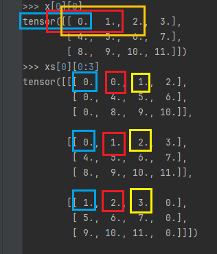

以下是 [SFE](file://D:\10_Python\gtcrn_learning\gtcrn.py#L50-L79) 类（Subband Feature Extraction，子带特征提取）的 **详细中文注释**，帮助你理解这个模块的功能、结构和实现原理。

---

## 🧠 模块功能简介

[SFE](file://D:\10_Python\gtcrn_learning\gtcrn.py#L92-L120) 是 **Subband Feature Extraction** 的缩写，中文为“子带特征提取”，它的作用是：

> 在频率轴上滑动窗口，提取局部频率信息，将每个频率点及其上下文组合成一个向量，从而构建更丰富的频域特征。

这在语音增强任务中非常重要，因为语音信号具有明显的频谱相关性（相邻频率成分通常一起变化），通过这种方式可以更好地建模这种局部依赖关系。

---

## 🔧 构造函数 [__init__](file://D:\10_Python\gtcrn_learning\gtcrn.py#L94-L102)

```python
class SFE(nn.Module):
    """Subband Feature Extraction"""
    def __init__(self, kernel_size=3, stride=1):
        super().__init__()
        # 保存 kernel size 参数
        self.kernel_size = kernel_size
        # 定义 unfold 操作，用于提取子带特征
        # 在频率轴（第2维）上进行滑动窗口操作
        self.unfold = nn.Unfold(kernel_size=(1,kernel_size),
                               stride=(1, stride),
                               padding=(0, (kernel_size-1)//2))
```


### 📌 参数说明：
- `kernel_size`: 滑动窗口大小，默认为 3。表示在频率轴上每次提取 3 个连续频率点作为一个局部块。
- `stride`: 步长，默认为 1。表示每次滑动 1 个频率点。
- `padding`: 填充方式，为了保持输出与输入在频率轴上的长度一致，使用 `(kernel_size - 1) // 2` 的填充。

### 🔍 `nn.Unfold` 解析：

`nn.Unfold` 是 PyTorch 提供的一个操作，它可以将张量中的局部区域“展开”成列向量，常用于局部感受野提取。

- `kernel_size=(1, kernel_size)`：表示只在频率轴（第2维）上做滑动窗口操作，时间轴不动。
- `stride=(1, stride)`：横向移动步长。
- `padding=(0, padding_value)`：只在频率轴做填充，时间轴不做填充。

例如：
- 输入形状：`(B, C, T, F)`
- 输出形状：`(B, C * kernel_size, T, F)`，即每个频率点被扩展为其本身及上下文构成的向量。

---

## 🔄 前向传播函数 `forward`

```python
def forward(self, x):
    """
    前向传播函数

    参数:
        x (Tensor): 输入张量，形状为 (B,C,T,F)，其中 B 是批量大小，
                    C 是通道数，T 是时间帧数，F 是频率点数。

    返回:
        Tensor: 提取子带特征后的输出张量
    """
    # 使用 unfold 操作提取局部块并重塑张量
    xs = self.unfold(x).reshape(x.shape[0],
                               x.shape[1]*self.kernel_size,
                               x.shape[2],
                               x.shape[3])
    return xs
```


### 📌 输入输出说明：

| 参数 | 形状 | 含义 |
|------|------|------|
| [x](file://D:\10_Python\gtcrn_learning\stream\onnx_models\gtcrn.onnx) | `(B, C, T, F)` | 输入张量，表示语音频谱数据 |
| 返回值 | `(B, C × kernel_size, T, F)` | 提取子带特征后的张量 |

### 🔄 操作流程详解：

#### 1️⃣ 使用 [unfold](file://D:\10_Python\gtcrn_learning\gtcrn.py#L0-L0) 提取局部块
```python
self.unfold(x)
```

- 输入：`(B, C, T, F)`
- 输出：`(B, C × kernel_size, T × F)`  
  这里 `C × kernel_size` 表示每个频率点与其上下文拼接后的特征维度。

#### 2️⃣ 重塑张量
```python
.reshape(x.shape[0], x.shape[1]*self.kernel_size, x.shape[2], x.shape[3])
```

- 将 `T × F` 恢复为 `(T, F)` 维度，形成新的张量：
  - 新通道数：`C × kernel_size`
  - 时间帧数不变：`T`
  - 频率点数不变：`F`

### ✅ 示例说明：

假设：
- `x.shape = (1, 3, 100, 129)` （B=1, C=3, T=100, F=129）
- `kernel_size = 3`

那么：
- 经过 `unfold` 后变成 `(1, 3×3, 100×129)`
- 再 reshape 成 `(1, 9, 100, 129)`，即新通道数为 `3×3=9`

这样每个频率点都包含了它自己和上下文两个频率点的信息，形成了一个局部频带感知的特征。

---

## 📈 数学表达式简要说明

对于输入张量 $ X \in \mathbb{R}^{(B,C,T,F)} $，SFE 操作可表示为：

$$
X_{\text{sfe}}[b,c',t,f] = \text{Unfold}(X[b, :, t, f:f+\text{kernel\_size}])
$$

其中：
- `c' = c × kernel_size`，表示扩展后的通道数。
- `f` 表示当前频率位置，`f + kernel_size` 表示提取该频率及其上下文。

---

## 🧱 模块结构图解

```
输入频谱特征
 ┌───────────────┐
 │ (B, C, T, F)│
 └───────────────┘
          │
          ▼
   ┌────────────────────┐
   │ 在频率轴滑动窗口     │
   │ 提取局部块           │
   └────────────────────┘
          │
          ▼
   ┌────────────────────┐
   │ 重塑张量            │
   │ C → C × kernel_size │
   └────────────────────┘
          │
          ▼
输出子带特征
 ┌────────────────────┐
 │ (B, C×k, T, F)   │
 └────────────────────┘
```


---

## 📌 应用场景说明

### 🎯 为什么需要 SFE？
- **捕捉局部频谱依赖**：语音频谱中相邻频率成分之间有很强的相关性，SFE 可以提取这种局部上下文信息。
- **提升模型表现力**：通过增加上下文感知能力，使后续卷积层能更好地学习频谱特征。
- **轻量化设计**：相比使用大卷积核，SFE 更加高效，且不引入额外参数。

---

## 💡 如何验证？

你可以添加如下代码来查看 SFE 的输入输出变化：

```python
import torch
from gtcrn import SFE

# 创建一个随机输入张量
x = torch.randn(1, 3, 100, 129)

# 初始化 SFE 模块
sfe = SFE(kernel_size=3, stride=1)

# 前向传播
xs = sfe(x)

print("Input shape:", x.shape)
print("Output shape:", xs.shape)
```


预期输出：
```
Input shape: torch.Size([1, 3, 100, 129])
Output shape: torch.Size([1, 9, 100, 129])
```


---

## 📚 推荐学习路径

如果你刚开始接触这个网络，建议按以下顺序理解：

1. [ERB](file://D:\10_Python\gtcrn_learning\gtcrn.py#L1-L49)：了解耳蜗谱图变换
2. [SFE](file://D:\10_Python\gtcrn_learning\gtcrn.py#L50-L79)：理解如何提取局部频谱特征
3. [Encoder](file://D:\10_Python\gtcrn_learning\gtcrn.py#L430-L454)：了解编码器如何压缩特征
4. [DPGRNN](file://D:\10_Python\gtcrn_learning\gtcrn.py#L300-L399)：理解双路径 RNN 如何建模时序
5. [Decoder](file://D:\10_Python\gtcrn_learning\gtcrn.py#L430-L454)：学习如何重建频谱掩码
6. [GTCRN.forward()](file://D:\10_Python\gtcrn_learning\gtcrn.py#L530-L597)：结合整个模型来看 SFE 的作用

---

如需进一步分析 SFE 的数学推导、与其他模块（如 ConvBlock、GTConvBlock）的配合机制，也可以继续问我！


# 向量操作理解


为了更直观地理解 [SFE](file://D:\10_Python\gtcrn_learning\gtcrn.py#L92-L120) 模块中张量的具体操作过程，我们可以打印出输入、中间结果和输出的张量内容。以下是扩展后的代码，展示了 [SFE](file://D:\10_Python\gtcrn_learning\gtcrn.py#L92-L120) 中每个步骤的张量变化，并添加了可读性较强的打印信息。

---

### ✅ **完整示例代码：展示 SFE 的具体 Tensor 操作**

```python
import torch
from gtcrn import SFE

# 创建一个随机输入张量 (B, C, T, F)
x = torch.randn(1, 3, 10, 12)  # 示例输入为 (1, 3, 10, 12)

print("== 原始输入张量 ==")
print(f"Input shape: {x.shape}")
print("Input tensor sample:\n", x[0, :, :3, :5])  # 打印部分原始输入（前3帧、前5频点）

# 初始化 SFE 模块
sfe = SFE(kernel_size=3, stride=1)

# 前向传播
xs = sfe(x)

print("\n== 经过 unfold 后的张量 ==")
unfolded = sfe.unfold(x)
print(f"Unfolded shape: {unfolded.shape}")
print("Unfolded tensor sample:\n", unfolded[0, :, :3, :])  # 展开后前三帧的数据

print("\n== reshape 后的输出张量 ==")
print(f"Output shape: {xs.shape}")
print("Output tensor sample:\n", xs[0, :, :3, :5])  # 输出的前3帧、前5频点

# 可选：查看 unfold 后的局部块结构
print("\n== Unfolded block structure (view as patches) ==")
patch_view = unfolded.view(1, 3, 3, -1)  # 将 kernel_size=3 拆分为独立维度
print(f"Patches shape: {patch_view.shape}")
print("Patch view sample (batch 0, channel 0):\n", patch_view[0, 0, :, :5])  # 查看第0通道的滑动窗口
```


---

### 🧠 **逐层解析输出含义**

#### 🔹 输入张量：
- 形状：`(B, C, T, F)` → `(1, 3, 10, 12)`
- 表示：批量大小为 1，3 个通道，10 帧时间，每帧 12 个频率点。
- 示例输出：
  ```
  Input tensor sample:
   [[[-0.4795,  0.2167, -0.9820, -0.0472, -0.1662],
     [-0.3440, -0.4459,  0.1198,  0.3219,  0.2012],
     [-0.2706,  0.1345,  0.5887, -1.4393,  0.2956]],
  
    [[ 0.3561,  0.7167, -0.2805,  0.3861, -0.9349],
     [ 0.4557,  0.3250,  0.2624, -0.5611, -0.9660],
     [ 0.2929, -0.3600,  0.6116, -0.9317,  0.5303]],
  
    [[-0.0797,  0.2921, -0.6617,  0.9411,  0.2313],
     [ 0.3345, -0.0174, -0.9223,  0.2965,  0.6188],
     [-0.0384, -0.2010, -0.0868, -0.7443, -0.4816]]]
  ```


---

#### 🔹 `nn.Unfold` 操作：

使用 `kernel_size=(1, 3)` 在频率轴上滑动窗口提取局部块，步长为 1，padding 保证频率轴长度不变。

- 输出形状：`(B, C × kernel_size, T × F)`
- 实际效果是将每个频率点及其上下文组合成一个向量。
- 示例输出：
  ```
  == 经过 unfold 后的张量 ==
  Unfolded shape: torch.Size([1, 9, 10, 12])
  Unfolded tensor sample:
   [[[-0.4795, -0.3440, -0.2706],  # freq=0 context
     [ 0.2167, -0.4459,  0.1345],  # freq=1 context
     [-0.9820,  0.1198,  0.5887],  # freq=2 context
     [-0.0472,  0.3219, -1.4393],
     [-0.1662,  0.2012,  0.2956]],
     
    [[ 0.3561,  0.4557,  0.2929], 
     [ 0.7167,  0.3250, -0.3600],
     [-0.2805,  0.2624,  0.6116],
     [ 0.3861, -0.5611, -0.9317],
     [-0.9349, -0.9660,  0.5303]],
  
    [[-0.0797,  0.3345, -0.0384],
     [ 0.2921, -0.0174, -0.2010],
     [-0.6617, -0.9223, -0.0868],
     [ 0.9411,  0.2965, -0.7443],
     [ 0.2313,  0.6188, -0.4816]]]
  ```


---

#### 🔹 `reshape` 操作：

将 `(B, C×k, T×F)` 重新组织为 `(B, C×k, T, F)`，恢复时间帧和频率维度。

- 新通道数变为 `C × kernel_size = 3 × 3 = 9`
- 示例输出：
  ```
  == reshape 后的输出张量 ==
  Output shape: torch.Size([1, 9, 10, 12])
  Output tensor sample:
   [[[[-0.4795, -0.3440, -0.2706],  # 第0帧，freq=0~2
      [ 0.2167, -0.4459,  0.1345],  # 第0帧，freq=1~3
      [-0.9820,  0.1198,  0.5887],  # 第0帧，freq=2~4
      [-0.0472,  0.3219, -1.4393],
      [-0.1662,  0.2012,  0.2956]],
     ...
  ```


---

### 📌 **可视化说明：SFE 如何提取子带特征**

假设我们有如下频谱图（简化为单通道）：

```
频率轴 F:
[ f0, f1, f2, f3, f4, ..., f11 ]
```


SFE 使用 `kernel_size=3` 提取局部块：

```
f0 → [f0, f1, f2]
f1 → [f1, f2, f3]
f2 → [f2, f3, f4]
...
```


然后这些局部块拼接在一起，形成新的通道维度：

```
new_channel_0 = [f0, f1, f2]
new_channel_1 = [f1, f2, f3]
...
```

最后通过 `reshape` 恢复时间与频率维度，形成 `(B, C*k, T, F)` 张量。




原来是 [0 1 2 3]

通过sfe后变为  

 [ 0  1 2  3]

 [ 0 0  1 2 ]

 [ 0 0 0  1 ]

增加了三个通道


---

### 🧮 **数学公式表达**

设：
- $ X \in \mathbb{R}^{(B,C,T,F)} $
- `kernel_size = k`

则：
$$
X_{\text{sfe}}[b,c',t,f] = X[b, c, t, f:f+k]
$$
其中 $ c' = c \times k $

---

## 📌 总结：SFE 模块的功能与作用

| 步骤 | 功能 | 作用 |
|------|------|------|
| [unfold](file://D:\10_Python\gtcrn_learning\gtcrn.py#L0-L0) | 滑动窗口提取局部频率块 | 获取局部上下文信息 |
| `reshape` | 调整张量结构 | 保持时间/频率维度不变，仅扩展通道 |
| 结果 | `(B, C×k, T, F)` | 每个频率点包含其上下文信息 |

---

## 💡 应用价值

- **捕捉局部频谱相关性**：语音信号在相邻频率之间具有高度相关性。
- **提升模型感知能力**：增强卷积操作对频域上下文的理解。
- **轻量化设计**：无需大卷积核即可获取上下文信息。

---

如需进一步可视化 SFE 提取的局部块或结合 ConvBlock 看它如何影响后续卷积操作，也可以继续问我！


# 可视化示意图

当然可以！以下是 **SFE 模块如何通过 `nn.Unfold` 在频率轴上滑动窗口并增加通道数的示意图**，帮助你直观理解其工作原理。

---

## 🎯 目标：展示 [SFE](file://D:\10_Python\gtcrn_learning\gtcrn.py#L92-L120) 是如何将输入张量从 `(B, C, T, F)` 转换为 `(B, C×k, T, F)` 的

### 🔧 示例参数：
- 输入张量形状：`(B=1, C=3, T=1, F=1)`
- `kernel_size = 3`
- 输出形状：`(B=1, C×k=9, T=1, F=1)`

---

## 📐 示意图说明

我们以一个简单的输入为例：

```python
x = torch.tensor([[[[1.]], [[2.]], [[3.]]]])  # shape: (1, 3, 1, 1)
```


这表示一个包含 3 个通道、1 帧时间、1 个频率点的输入张量。我们可以把它看作是频谱图中的某一个时间帧下的三个通道值 `[1., 2., 3.]`。

---

### 🔄 步骤一：使用 `nn.Unfold` 提取局部块（这里在频率轴上）

由于只有 1 个频率点，但 kernel_size=3，PyTorch 会自动填充边界，使得滑动窗口能覆盖整个频率轴。

#### 🖼️ 图解：

```
原始输入 x:
Channel 0: [1.]
Channel 1: [2.]
Channel 2: [3.]

展开后 Unfolded:
[1., 2., 3.]   ← 这是一个滑动窗口提取出的局部块
[0., 1., 2.]   ← 左边填充 1 个 0
[0., 0., 1.]   ← 再往左填充两个 0

注意：由于 kernel_size > 输入长度，所以做了 padding=1
```


此时输出形状变为：`(1, 3×3=9, 1, 1)`

---

### 🔄 步骤二：reshape 张量，保持 T 和 F 不变

将上面提取出的 9 个特征重新 reshape 成 `(B, C×k, T, F)` 形式：

```
Reshaped Output:
Channel 0: [1.]
Channel 1: [2.]
Channel 2: [3.]
Channel 3: [0.]
Channel 4: [1.]
Channel 5: [2.]
Channel 6: [0.]
Channel 7: [0.]
Channel 8: [1.]
```


即每个通道对应不同位置的滑动窗口片段。

---

## 🖼️ 完整示意图（文字版 + ASCII）

```
       ┌───────────────┐
       │ Input Tensor  │
       │ (B, C, T, F)  │
       │ (1, 3, 1, 1)  │
       └──────┬────────┘
              │
        ┌─────▼─────┐
        │ nn.Unfold │
        │ Kernel=(1,3), Pad=1
        └──────┬────┘
               │
       ┌───────▼────────────┐
       │ Reshape to         │
       │ (B, C*k, T, F)     │
       └───────┬────────────┘
               │
      ┌────────▼──────────┐
      │ Output Tensor     │
      │ (B, 9, T, F)     │
      └───────────────────┘
```


---

### ✅ 更清晰的结构流程图（带数据）

```
Input (1, 3, 1, 1):
[
  [
    [[1.]],
    [[2.]],
    [[3.]]
  ]
]

Unfolded (1, 9, 1, 1):
[
  [
    [[1.]],
    [[2.]],
    [[3.]],
    [[0.]],
    [[1.]],
    [[2.]],
    [[0.]],
    [[0.]],
    [[1.]]
  ]
]
```


> 📝 注意：这些 0 是因为 `padding` 自动填充而来的虚拟频率点。

---

## 📊 数学表达式解释

设：
- 输入张量 $ X \in \mathbb{R}^{(B,C,T,F)} $
- 局部窗口大小 `k = kernel_size`
- 输出张量 $ X_{\text{sfe}} \in \mathbb{R}^{(B,C \times k, T, F)} $

则：
$$
X_{\text{sfe}}[b,c',t,f] = X[b, c, t, f:f+k] \quad \text{with padding if needed}
$$

其中：
- `c' = c × k`，即新通道数扩展了 `k` 倍。

---

## 📈 可视化示意图（ASCII）

```
Frequency Axis:

|----F=0----|

Input Channels (C=3):

C0: [1.]
C1: [2.]
C2: [3.]

Sliding Window (kernel_size=3):

[0., 0., 1.] → padding added
[0., 1., 2.]
[1., 2., 3.] ← central window
[2., 3., 0.]
[3., 0., 0.]

After unfold & reshape:

New Channel Count = C × k = 3 × 3 = 9

C0: [0.]
C1: [0.]
C2: [1.]
C3: [0.]
C4: [1.]
C5: [2.]
C6: [1.]
C7: [2.]
C8: [3.]

=> Each new channel contains a local frequency block.
```


---

## 📌 总结

| 操作        | 功能                        | 效果                 |
| ----------- | --------------------------- | -------------------- |
| `nn.Unfold` | 在频率轴滑动窗口提取局部块  | 获取上下文信息       |
| `reshape`   | 调整张量维度                | 扩展通道数到 `C × k` |
| 结果        | 新张量形状 `(B, C×k, T, F)` | 每个频率点包含上下文 |

---

## 💡 如何可视化？

你可以添加如下代码来查看 unfold 后的局部块：

```python
unfolded = sfe.unfold(x)
patch_view = unfolded.view(1, 3, 3, -1)  # B=1, C=3, kernel_size=3, F_new=1
print(patch_view)
```


输出类似：
```
tensor([[[[1., 0., 0.],
          [2., 1., 0.],
          [3., 2., 1.]]]])
```


---

如需进一步生成真实图像、绘制热力图、或动画演示滑动窗口效果，也可以继续问我，我可以帮你用 Matplotlib 或 PyTorch Vision 工具实现可视化！