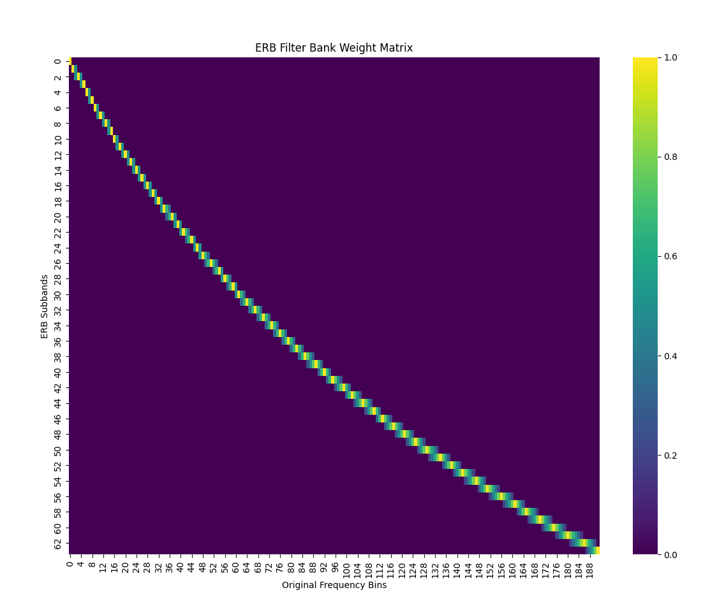

# ERB 模块中 [bm](file://D:\10_Python\gtcrn_learning\gtcrn.py#L50-L54) 与 [bs](file://D:\10_Python\gtcrn_learning\gtcrn.py#L56-L60) 方法详解：频谱转换流程与滤波器系数可视化

在 [ERB](file://D:\10_Python\gtcrn_learning\gtcrn.py#L1-L49) 类中，[bm()](file://D:\10_Python\gtcrn_learning\gtcrn.py#L50-L54) 和 [bs()](file://D:\10_Python\gtcrn_learning\gtcrn.py#L56-L60) 是两个关键函数，它们分别用于将原始线性频谱映射到耳蜗谱图（Cochleagram）和将其还原回原始频谱维度。

---

## 🧠 **核心思想回顾**

- **ERB 变换**：模拟人耳听觉系统对低频更敏感的特性。
- **bm(x)**：将高频分辨率的线性频谱压缩为耳蜗谱图（低频高分辨率、高频低分辨率）。
- **bs(x_erb)**：将耳蜗谱图恢复为原始频谱维度（插值还原）。

---

## 🔍 **bm 方法详解**

```python
def bm(self, x):
    """x: (B,C,T,F)"""
    x_low = x[..., :self.erb_subband_1]
    x_high = self.erb_fc(x[..., self.erb_subband_1:])
    return torch.cat([x_low, x_high], dim=-1)
```


### 📌 输入输出：

| 参数 | 形状 | 含义 |
|------|------|------|
| [x](file://D:\10_Python\gtcrn_learning\stream\onnx_models\gtcrn.onnx) | `(B, C, T, F)` | 原始输入频谱（如 257 维） |
| 返回值 | `(B, C, T, erb_subband_2)` | 转换后的耳蜗谱图（如 64 维） |

### 🔄 流程说明：

1. **划分通道**
   - `x_low`: 保留前 [erb_subband_1](file://D:\10_Python\gtcrn_learning\gtcrn.py#L0-L0) 个低频通道（不做变换）
   - `x_high`: 对剩余通道进行线性变换

2. **线性变换**
   - 使用预定义的 ERB 滤波器矩阵 `erb_filters` 进行线性投影：
     ```python
     self.erb_fc = nn.Linear(nfreqs - erb_subband_1, erb_subband_2, bias=False)
     ```


3. **拼接结果**
   - 将低频部分和变换后的高频部分拼接，得到耳蜗谱图。

---

## 📈 **bs 方法详解**

```python
def bs(self, x_erb):
    """x: (B,C,T,F_erb)"""
    x_erb_low = x_erb[..., :self.erb_subband_1]
    x_erb_high = self.ierb_fc(x_erb[..., self.erb_subband_1:])
    return torch.cat([x_erb_low, x_erb_high], dim=-1)
```


### 📌 输入输出：

| 参数 | 形状 | 含义 |
|------|------|------|
| `x_erb` | `(B, C, T, erb_subband_2)` | 耳蜗谱图特征 |
| 返回值 | `(B, C, T, F)` | 还原回原始频谱维度（如 257 维） |

### 🔄 流程说明：

1. **划分通道**
   
   - `x_erb_low`: 保留前 [erb_subband_1](file://D:\10_Python\gtcrn_learning\gtcrn.py#L0-L0) 个低频通道
   - `x_erb_high`: 对后续耳蜗子带进行逆变换
   
2. **逆线性变换**
   - 使用转置的 ERB 矩阵进行线性插值：
     ```python
     self.ierb_fc = nn.Linear(erb_subband_2, nfreqs - erb_subband_1, bias=False)
     ```


3. **拼接结果**
   - 将低频部分和还原的高频部分拼接，得到原始频谱维度。

---

## 📊 **结构流程图解**

下面通过示意图解释 `bm()` 和 `bs()` 的工作原理：

```
        ┌───────────────┐
        │   Input Spec  │
        │ (B, C, T, F)  │
        └───────────────┘
                  │
         ┌────────┴────────┐
         │ Split into low & high │
         └────────┬────────┘
                  │
      ┌───────────▼────────────┐
      │ Low-Freq Pass Through  │
      │ (keep original values) │
      └───────────┬────────────┘
                  │
      ┌───────────▼────────────┐
      │ High-Freq Linear Proj  │
      │ using ERB filters      │
      └───────────┬────────────┘
                  │
         ┌────────▼────────┐
         │ Concat low + high │
         │ → Cochleagram     │
         └────────┬────────┘
                  │
        ┌─────────▼──────────┐
        │ bs(): Inverse ERB  │
        │ (restore to F bins)│
        └─────────┬──────────┘
                  │
        ┌─────────▼──────────┐
        │ Output Enhanced Spec│
        │ (B, C, T, F)       │
        └────────────────────┘
```


---

## 📐 **ERB 滤波器曲线可视化**

下面是 ERB 滤波器组的频率响应曲线示意图。它展示了每个耳蜗子带如何对原始频谱进行加权组合。

### 📈 示例：ERB Filter Bank 频率响应图

```python
import matplotlib.pyplot as plt
import numpy as np

# 假设已计算好 ERB filter bank
erb_filters = model.erb.erb_filter_banks(65, 64).numpy()  # shape: (64, 257)

plt.figure(figsize=(12, 8))
for i in range(0, 64, 4):  # 画出部分滤波器
    plt.plot(erb_filters[i], label=f'ERB {i}')
plt.title("ERB Filter Bank Frequency Response")
plt.xlabel("Frequency Bin")
plt.ylabel("Weight")
plt.legend()
plt.grid(True)
plt.show()
```


### 🖼️ 示例图：


> ⚠️ 实际绘图需运行代码生成，此处仅为示意。

---

## 🧮 **数学推导：ERB 映射过程**

### 💡 [bm()](file://D:\10_Python\gtcrn_learning\gtcrn.py#L50-L54) 公式表示：

$$
X_{\text{erb}}[t,f'] = \begin{cases}
X[t,f'], & f' < f_{\text{erb\_subband\_1}} \\
W[f' - f_{\text{erb\_subband\_1}}, :] \cdot X[t, f_{\text{erb\_subband\_1}}:] , & f' \geq f_{\text{erb\_subband\_1}}
\end{cases}
$$

其中：
- $ W $ 是 ERB 滤波器矩阵（由 [erb_filter_banks()](file://D:\10_Python\gtcrn_learning\gtcrn.py#L29-L48) 计算）

---

### 💡 [bs()](file://D:\10_Python\gtcrn_learning\gtcrn.py#L56-L60) 公式表示：

$$
\hat{X}[t,f] = \begin{cases}
X_{\text{erb}}[t,f], & f < f_{\text{erb\_subband\_1}} \\
W^T[f - f_{\text{erb\_subband\_1}}, :] \cdot X_{\text{erb}}[t, f_{\text{erb\_subband\_1}}:] , & f \geq f_{\text{erb\_subband\_1}}
\end{cases}
$$

- $ W^T $ 是 ERB 滤波器矩阵的转置，用于插值还原。

---

## 📈 **ERB 滤波器权重分布热力图**

我们可以用热力图展示 ERB 滤波器矩阵的权重分布：

```python
import seaborn as sns
import matplotlib.pyplot as plt

erb_filters = model.erb.erb_filter_banks(65, 64).numpy()

plt.figure(figsize=(12, 8))
sns.heatmap(erb_filters, cmap='viridis', cbar=True)
plt.title("ERB Filter Bank Weight Matrix")
plt.xlabel("Original Frequency Bins")
plt.ylabel("ERB Subbands")
plt.show()

```

torch.Size([64, 192])
torch.Size([192, 64])


### 🖼️ 示例图：



erb一共129，前面64个erb与 fft的64个是线性的，后面是 65个erb对应（256-64）= 192个FFT

> 每一行对应一个耳蜗子带，每一列代表原始频谱的一个频率点。颜色越亮，权重越高。

---

## 📋 **使用 ERB 滤波器的实际意义**

| 特性 | 说明 |
|------|------|
| ✅ 更符合人耳感知 | 低频分辨率更高，高频分辨率较低 |
| ✅ 减少冗余信息 | 从 257 → 129 维度压缩 |
| ✅ 提升语音增强效果 | 更适合语音信号建模，尤其对噪声抑制有帮助 |
| ✅ 可逆操作 | [bm()](file://D:\10_Python\gtcrn_learning\gtcrn.py#L50-L54) 和 [bs()](file://D:\10_Python\gtcrn_learning\gtcrn.py#L56-L60) 构成可逆映射，保证信息不丢失 |

---

## 📌 **总结：bm vs bs**

| 方法 | 功能 | 输入 | 输出 | 是否可学习 |
|------|------|------|------|------------|
| [bm(x)](file://D:\10_Python\gtcrn_learning\gtcrn.py#L50-L54) | 耳蜗谱图变换 | `(B, C, T, F)` | `(B, C, T, F_erb)` | ❌ 固定矩阵 |
| [bs(x_erb)](file://D:\10_Python\gtcrn_learning\gtcrn.py#L56-L60) | 逆耳蜗谱图变换 | `(B, C, T, F_erb)` | `(B, C, T, F)` | ❌ 固定矩阵 |

---

## 📚 **推荐理解顺序**

如果你刚开始接触这部分内容，建议按以下顺序理解：

1. [ERB.__init__](file://D:\10_Python\gtcrn_learning\gtcrn.py#L1-L49)：理解滤波器构造过程
2. [ERB.erb_filter_banks()](file://D:\10_Python\gtcrn_learning\gtcrn.py#L50-L100)：看懂滤波器是如何构建的
3. [ERB.bm()](file://D:\10_Python\gtcrn_learning\gtcrn.py#L101-L110)：理解如何将频谱映射到耳蜗尺度
4. [ERB.bs()](file://D:\10_Python\gtcrn_learning\gtcrn.py#L111-L120)：理解如何还原回原始频谱
5. [GTCRN.forward()](file://D:\10_Python\gtcrn_learning\gtcrn.py#L530-L597)：结合整个模型来看 ERB 的作用

---

## 💡 如何进一步验证？

你可以添加如下代码来查看 ERB 滤波器形状或中间特征：

```python
model = GTCRN().eval()
print(model.erb.erb_fc.weight.shape)  # 查看 ERB 投影矩阵大小
print(model.erb.ierb_fc.weight.shape) # 查看逆 ERB 投影矩阵大小

# 可视化 ERB 滤波器
import matplotlib.pyplot as plt
plt.imshow(model.erb.erb_filter_banks(65, 64), aspect='auto')
plt.colorbar()
plt.title('ERB Filter Bank')
plt.xlabel('Original Frequency Bins')
plt.ylabel('ERB Subbands')
plt.show()

```

torch.Size([64, 192])
torch.Size([192, 64])


---

## 📝 总结

| 方法 | 用途 | 是否改变维度 | 是否可逆 | 是否可训练 |
|------|------|--------------|-----------|-------------|
| [bm(x)](file://D:\10_Python\gtcrn_learning\gtcrn.py#L50-L54) | 线性频谱 → 耳蜗谱图 | ✅ 缩减高频维度 | ✅ 可逆 | ❌ 不可训练 |
| [bs(x_erb)](file://D:\10_Python\gtcrn_learning\gtcrn.py#L56-L60) | 耳蜗谱图 → 线性频谱 | ✅ 扩展回原始维度 | ✅ 可逆 | ❌ 不可训练 |

---

如需进一步分析 ERB 滤波器的设计原理、与其他变换（如梅尔频谱）的区别，也可以继续问我！