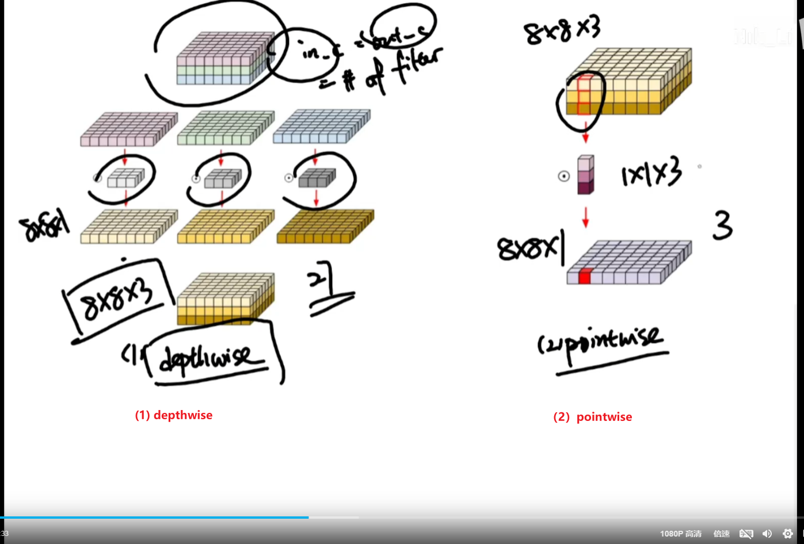

# 深度可分离卷积（Depthwise Separable Convolution）


## 视频学习

https://www.bilibili.com/video/BV1BM4m1m7YL/?spm_id_from=333.337.search-card.all.click&vd_source=7ede8e6d75f0ded5e84bb177aa741d76



分成两部分：

- 每个通道对应一个卷积核，同一个卷积核 不去关联不同的通道
- 最后通过一个 （3，1）的卷积核，把 不同的通道权重相加

如果channel 想要变成 256呢，depthwise那里的卷积核变成 3\*1\*256


深度可分离卷积（Depthwise Separable Convolution）是现代轻量级神经网络（如 MobileNet、ShuffleNet、GTCRN 中的 [GTConvBlock](file://D:\10_Python\gtcrn_learning\gtcrn.py#L228-L298)）中常用的一种卷积操作，它将标准卷积分解为两个步骤：

1. **深度卷积**（Depthwise Convolution）
2. **逐点卷积**（Pointwise Convolution）

这种设计可以显著减少计算量和参数数量，同时保持模型性能。

---

## 🧱 深度可分离卷积的组成

### 1️⃣ 深度卷积（Depthwise Convolution）

> 每个输入通道独立进行卷积操作，不跨通道融合信息。

- 输入通道数：`C_in`
- 输出通道数：`C_out = C_in × multiplier`（通常 multiplier=1）
- 卷积核大小：`k x k`（例如 3×3）
- 每个通道使用一个独立的 `k x k` 卷积核
- 不改变通道数（如果 multiplier=1）

### 🔢 公式：
对于每个输入通道 $ i \in [0, C_{\text{in}} - 1] $：
$$
y_i = \sum_{a=0}^{k-1} \sum_{b=0}^{k-1} x_i[a,b] \cdot w_i[a,b]
$$

### 💡 特点：
- 计算量小（没有跨通道计算）
- 参数少（每个通道一个卷积核）
- 保留空间结构，但不能跨通道融合特征

---

### 2️⃣ 逐点卷积（Pointwise Convolution）

> 使用 `1x1` 卷积进行通道之间的线性组合（即通道变换）

- 输入通道数：`C_in`
- 输出通道数：`C_out`
- 卷积核大小：`1x1`
- 每个输出通道都是所有输入通道的加权求和

### 🔢 公式：
对于每个输出通道 $ o \in [0, C_{\text{out}} - 1] $：
$$
y_o = \sum_{i=0}^{C_{\text{in}} - 1} x_i \cdot w_{o,i}
$$

### 💡 特点：
- 负责跨通道信息融合
- 可以增加或减少通道数
- 配合激活函数引入非线性

---

## 📌 示例说明

### ✅ 设定参数

```python
import torch
import torch.nn as nn

# 假设输入张量
x = torch.randn(1, 16, 50, 129)  # (B, C, T, F)

# 深度可分离卷积配置
depth_conv = nn.Conv2d(
    in_channels=16,
    out_channels=16,
    kernel_size=(3,3),
    stride=(1,1),
    padding=(1,1),
    dilation=(1,1),
    groups=16   # 设置为输入通道数 → 深度卷积
)
point_conv = nn.Conv2d(
    in_channels=16,
    out_channels=32,
    kernel_size=1,
    stride=1,
    padding=0
)
```


### 📈 输入输出形状变化

| 层 | 输入形状 | 输出形状 |
|----|----------|------------|
| 输入 | `(1, 16, 50, 129)` | - |
| 深度卷积 (`3x3`, `groups=16`) | `(1, 16, 50, 129)` | `(1, 16, 50, 129)` |
| 逐点卷积 (`1x1`) | `(1, 16, 50, 129)` | `(1, 32, 50, 129)` |

---

## 🧮 参数量对比（假设 `C_in=16`, `C_out=32`, `k=3`）

| 类型 | 参数公式 | 数量 |
|------|--------|------|
| 标准卷积 | `C_out × C_in × k × k` | `32 × 16 × 3 × 3 = 4608` |
| 深度可分离卷积 | `C_in × k × k + C_out × C_in × 1 × 1` | `16 × 3 × 3 + 32 × 16 × 1 × 1 = 144 + 512 = 656` |
| 减少比例 | —— | ~85% reduction |

---

## 🎯 在 GTCRN 中的应用场景

在你提供的代码中：

```python
self.depth_conv = conv_module(hidden_channels, hidden_channels, kernel_size,
                              stride=stride, padding=padding,
                              dilation=dilation, groups=hidden_channels)
```


- 这是一个**深度卷积层**
- `groups=hidden_channels` 表示每个通道单独处理
- 紧接着的是一个 `1x1` 的 [point_conv2](file://D:\10_Python\gtcrn_learning\gtcrn.py#L0-L0)，用于跨通道融合

```python
self.point_conv2 = conv_module(hidden_channels, in_channels//2, 1)
```


这样就构成了完整的 **深度可分离卷积结构**

---

## 🧠 举个例子（具体数值演示）

### 输入张量：
```python
x.shape = (1, 16, 50, 129)  # B=1, C=16, T=50, F=129
```


### Step 1: 深度卷积
```python
depth_conv = nn.Conv2d(16, 16, 3, padding=1, groups=16)
h1 = depth_conv(x)  # h1.shape = (1, 16, 50, 129)
```


### Step 2: 1×1 逐点卷积
```python
point_conv = nn.Conv2d(16, 32, 1)
h2 = point_conv(h1)  # h2.shape = (1, 32, 50, 129)
```


此时完成了：
- 空间建模（通过 3×3 卷积）
- 通道建模（通过 1×1 卷积）

---

## 📊 结构流程图（文字版）

```
Input:
(B, C_in=16, T=50, F=129)

[Depthwise Conv (3x3)]:
对每个通道分别做 3x3 卷积 → (B, C_in=16, T=50, F=129)

[Pointwise Conv (1x1)]:
对通道维度做线性组合 → (B, C_out=32, T=50, F=129)
```


---

## 🧰 PyTorch 实现（完整模块）

```python
class DepthwiseSeparableConv(nn.Module):
    def __init__(self, in_channels, out_channels, kernel_size):
        super().__init__()
        self.depth_conv = nn.Conv2d(in_channels, in_channels, kernel_size,
                                   padding=(kernel_size-1)//2,
                                   groups=in_channels)
        self.point_conv = nn.Conv2d(in_channels, out_channels, 1)

        self.bn = nn.BatchNorm2d(out_channels)
        self.act = nn.PReLU()

    def forward(self, x):
        x = self.depth_conv(x)
        x = self.point_conv(x)
        x = self.bn(x)
        x = self.act(x)
        return x
```


---

## 📈 总结表格

| 组件 | 功能 | 是否跨通道交互 | 参数量 | 是否降维/升维 |
|------|------|------------------|---------|----------------|
| 深度卷积 | 空间建模 | ❌ 否 | `C_in × k × k` | ❌ 否 |
| 逐点卷积 | 通道建模 | ✅ 是 | `C_out × C_in × 1 × 1` | ✅ 是 |

---

## ✅ 优势总结

| 优势 | 描述 |
|------|------|
| 计算高效 | 大幅减少 MAC 和参数 |
| 小模型友好 | 适合部署在边缘设备（如手机、嵌入式系统） |
| 保持精度 | 在合理设计下，性能接近标准卷积 |
| 模块化强 | 可灵活组合成 Inverted Residual、MobileNet Block 等 |

---

## 📚 相关扩展阅读

如果你感兴趣，还可以继续了解：
- MobileNetV1/V2/V3 的改进策略
- ShuffleNet 的分组与通道混洗机制
- EfficientNet 的复合缩放方法
- 深度可分离卷积 + Squeeze-and-Excitation 的结合

---

如果你希望我为你画出该模块的可视化结构图、给出完整的训练建议、或者帮你分析某个具体层的参数规模，也可以继续问我！